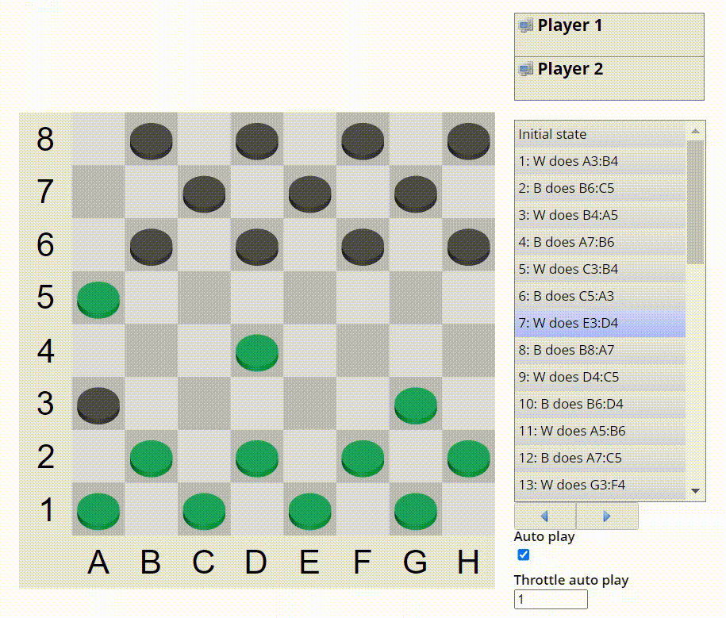

This repository hosts the checkers project for the "Systempraktikum" at LMU Munich in the winter semester 2023.

# Usage

1. Clone the repository.
2. Start a new game of checkers at http://sysprak.priv.lab.nm.ifi.lmu.de/checkers/ and copy the game ID.
3. Run `make && ./sysprak-client -g <game ID>` in the terminal; optionally add `-p <{1, 2}>` or `-c <config file>` to select your player number or the configuration file, respectively.
4. Follow the game in your browser or terminal.
